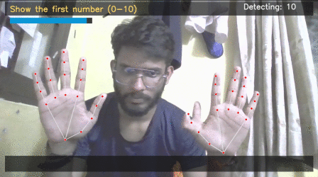
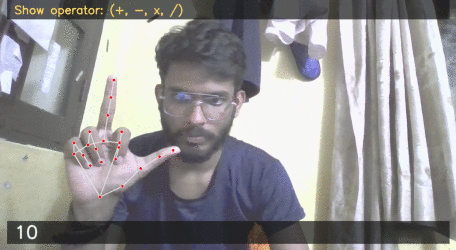
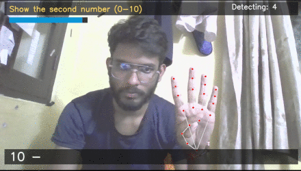
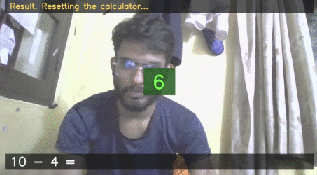

# Gesture Based Calculator

A touch-free calculator using real-time hand gesture recognition via your webcam. Powered by MediaPipe, OpenCV, and pyttsx3, perform arithmetic using only your hands—with live spoken results and a modern overlay UI.

 
 

---

## Features

- Real-time finger counting (0-10 using two hands)
- Recognizes operations: addition, subtraction, multiplication, division (via one-handed thumb+finger combos)
- Clean and modern overlay UI (non-clustered, live equation/result panels)
- Voice guidance and vocalized results
- Automatic and gesture-based reset
- Works cross-platform (Windows/Mac/Linux) with a webcam
- In-app help (press `H`)
- Graceful quit (`Q` or `ESC`)

---

## Installation

1. Make sure you have **Python 3.7+** and a webcam.
2. Clone/download this repo:
   ```sh
   git clone https://github.com/SarshijKarn/Gesture-Based-Calculator.git
   ```
   
3. Install required packages:
   ```sh
   pip install -r requirements.txt
   ```

---

## Usage

Run the main script:

```sh
python gesture.py
```

### How to Use
- Follow screen prompts.
- Show 0–10 fingers to input numbers (use both hands for 6–10).
- For operator:
    - Thumb + Index: `+`
    - Thumb + Middle: `-`
    - Thumb + Ring: `*`
    - Thumb + Little: `/`
  (Use **one hand** for operators.)
- Show second number.
- Result appears and is spoken aloud—calculator resets in 2 seconds.
- Press `H` for instructions at any point, `Q`/`ESC` to exit.

---

## Requirements

- opencv-python
- mediapipe
- pyttsx3

(see `requirements.txt`)

---

## Troubleshooting
- Camera may appear slow if run on old hardware or high-res.
  - Try closing other webcam apps or lower frame rate/resolution in `gesture.py`.
- "Hand not detected"? Ensure your hand(s) are visible and well-lit.
- If speech output fails, check `pyttsx3` install and OS voice engine.

---

## Credits
- Designed and implemented by Sarshij Karn.
- Uses [MediaPipe](https://google.github.io/mediapipe/), [OpenCV](https://opencv.org/), and [pyttsx3](https://pyttsx3.readthedocs.io/).

---


Ready to experience a futuristic calculator?
Run, gesture, calculate!
Enjoy hands-free calculation!
